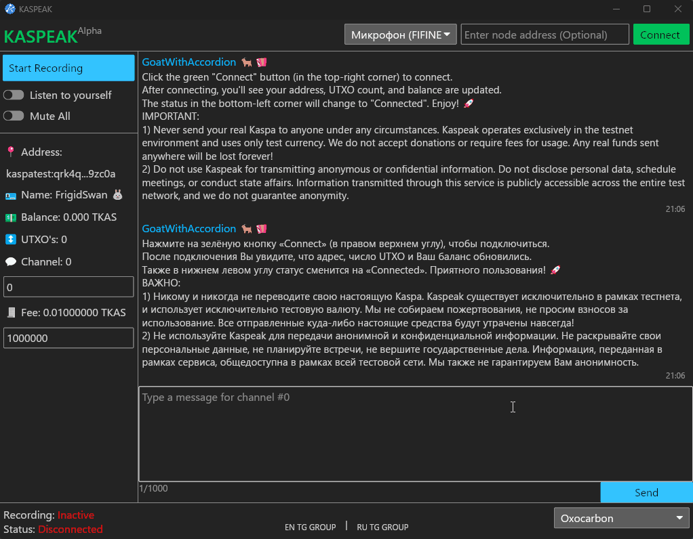

# Kaspeak

[](./README.md)
[](./README.ru.md)

<p align="center">

</p>

Встречайте **Kaspeak**: первый в мире (возможно) **голосовой (!)** чат в открытом блокдаг. Мы также добавили обычный чат, потому что голосовой не очень хорошо работает.

Это самый простой способ ощутить всю силу и скорость Kaspa TN11, включая 10 блоков в секунду (10 bps). Все ваши сообщения (голосовые или текстовые) хранятся и распространяются исключительно внутри блоков. Возможность записывать произвольные данные в блоки вдохновила нас на создание этой идеи и привела к её воплощению в виде Kaspeak.

## Ссылки и контакты

- [**Актуальный релиз**](https://github.com/kaspeak/Kaspeak/releases)
- [**Telegram (RU)**](https://t.me/kaspeak_ru)
- [**Telegram (EN)**](https://t.me/kaspeak_en)
- [**Twitter/X**](https://x.com/KaspeakOfficial)
- [**KSPK Token**](https://kas.fyi/token/krc20/KSPK) _(не торопитесь покупать до официального анонса будущего проекта)_
- [**Сайт**](http://kaspeak.net/) _(в процессе разработки)_
- [**Поддержка в Telegram**](https://t.me/kaspeak_support)
- **Email** — kaspeak@proton.me

## Сборка из исходного кода

<details>
  <summary>Windows</summary>

1. Установите [Rust и Cargo](https://www.rust-lang.org/tools/install).
2. Склонируйте репозиторий:
    ```bash
    git clone https://github.com/kaspeak/Kaspeak.git
    ```
3. Перейдите в папку проекта:
    ```bash
    cd Kaspeak
    ```
4. Соберите проект в релизном режиме:
    ```bash
    cargo run --release
    ```
5. Запустите полученный исполняемый файл из `target/release/`.

</details>

<details>
  <summary>Linux</summary>

Работоспособность и сборка на Linux проверена не была. Мы будем рады, если вы поделитесь своим опытом и информацией о необходимых зависимостях и пакетах.

</details>

<details>
  <summary>macOS</summary>

1. Установите [Homebrew](https://brew.sh/) при необходимости.  
2. Установите **Opus**:
    ```bash
    brew install opus
    ```
3. Установите [Rust/Cargo](https://www.rust-lang.org/tools/install) (если не установлено).  
4. Склонируйте репозиторий:
    ```bash
    git clone https://github.com/kaspeak/Kaspeak.git
    cd Kaspeak
    ```
5. **Сборка и запуск**:
    ```bash
    cargo run --release
    ```
    Скомпилированный исполняемый файл будет доступен в `target/release/`.
6. **Упаковка в .app** (чтобы потом поместить в Applications):
    
    Для этого нужен `cargo-bundle`:
    ```bash
    cargo install cargo-bundle
    ```
    Затем выполните:
    ```bash
    sh generate_macos_app.sh
    ```
    По завершении скрипт выведет путь к готовому `.app`, который можно перенести в папку Applications.

</details>

## Содержание
1. [Важная информация](#важная-информация)
2. [Как использовать](#как-использовать)
3. [Что ещё можно сделать](#что-еще-можно-сделать)
4. [Что может пойти не так](#что-может-пойти-не-так)
5. [Примечание от одного из создателей](#примечание-от-одного-из-создателей)
6. [Отказ от ответственности](#отказ-от-ответственности)
7. [Как помочь нам](#как-помочь-нам)

---

## Важная информация

1. **Никогда не отправляйте настоящую Kaspa.**
    Kaspeak предназначен только для тестовой сети и использует исключительно тестовую валюту TKAS. Мы не принимаем пожертвования и не требуем никаких взносов. Любые реальные средства, отправленные куда-либо, будут утрачены навсегда!

2. **Не используйте Kaspeak для анонимной или конфиденциальной информации.**
    Не раскрывайте личные данные, не назначайте встречи и не вершите государственные дела. Информация, переданная с помощью Kaspeak, общедоступна во всей тестовой сети. Мы также не гарантируем анонимность.

---

## Как использовать

1. **Скачайте готовый [релиз](https://github.com/kaspeak/Kaspeak/releases)** или соберите клиент (см. выше).
2. **Запустите клиент.**
3. Нажмите большую зелёную кнопку **Connect** в правом верхнем углу экрана.
    - Если у вас нет собственной TN11-ноды, оставьте соседнее поле пустым.
4. Дождитесь загрузки адреса и выдачи airdrop (баланс должен стать больше 0).
5. **Текстовый чат**:
    - **Enter** — отправка сообщения
    - **Shift + Enter** — перенос строки
    - Учитывайте, что горячие клавиши могут не работать, если раскладка не латинская
6. Чтобы транслировать свой голос в текущий канал, нажмите **Start Recording**.
7. Нажмите **Stop Recording**, когда закончите речь.
    - Не держите запись включённой слишком долго — задержка растёт со временем.

---

## Что ещё можно сделать

- **Настройте доплату за комиссию** (0–10 TKAS), чтобы при необходимости ускорить отправку своих голосовых и текстовых сообщений.
- **Выберите один из 10 миллионов каналов**:
  - Голос и текст видны и слышны только в рамках выбранного канала.
  - Можно занять любой свободный канал и исследовать возможности Kaspa вместе с другом.
  - В любой момент можно вернуться к предыдущему каналу.
- Если у вас нет друзей, это печально, но всё равно не помешает оценить скорость Kaspa!
  - Включите **Listen Self**, чтобы услышать собственный голос, доносящийся из глубин блокдаг.
- При необходимости используйте переключатель **Mute All**, чтобы заглушить все голосовые сообщения в выбранном канале.

---

## Что может пойти не так

Абсолютно всё!
- Ошибка подключения к публичной ноде,
- Невозможность запустить приложение,
- Вылеты, задержки, высокий пинг,
- Ошибки в интерфейсе и многое другое.

Если вам кажется, что Kaspeak работает некорректно, вероятно, так и есть. В любой непонятной ситуации вы можете:

- **Перезапустить** приложение.
- **Удалить** файл `settings.kspk`.

Это решает 99% всех существующих проблем. При желании, вы можете описать свою проблему и отправить файл `kaspeak.log` сюда: [@kaspeak_support](https://t.me/kaspeak_support).

---

## Примечание от одного из создателей

Kaspeak был создан, чтобы продемонстрировать разработчикам и пользователям со всего мира ту силу, скорость и возможности сети Kaspa, которые не видны из торговых терминалов. Только мы, сообщество, сможем сделать Kaspa великой!

---

## Отказ от ответственности

- Kaspeak полностью децентрализован и использует публичные ноды Kaspa TN11.
- Мы не можем контролировать, удалять или изменять данные, передаваемые в блокдаг.
- У нас нет серверов, и мы не храним пользовательские данные. Просим вас вести себя сдержанно и не использовать децентрализованный сервис для размещения противоправной информации или рекламы.

---

## Как помочь нам

- Рассказывайте о возможностях Kaspa людям вокруг вас.
- Сообщайте о найденных проблемах и предлагайте идеи.
- Если у вас есть серьёзный опыт с **rusty Kaspa**, помогите нам в вопросах формирования и отправки транзакций.
- Любые вопросы и предложения: [@kaspeak_support](https://t.me/kaspeak_support)

---

**Приятного знакомства с Kaspeak в тестовой сети Kaspa TN11!**